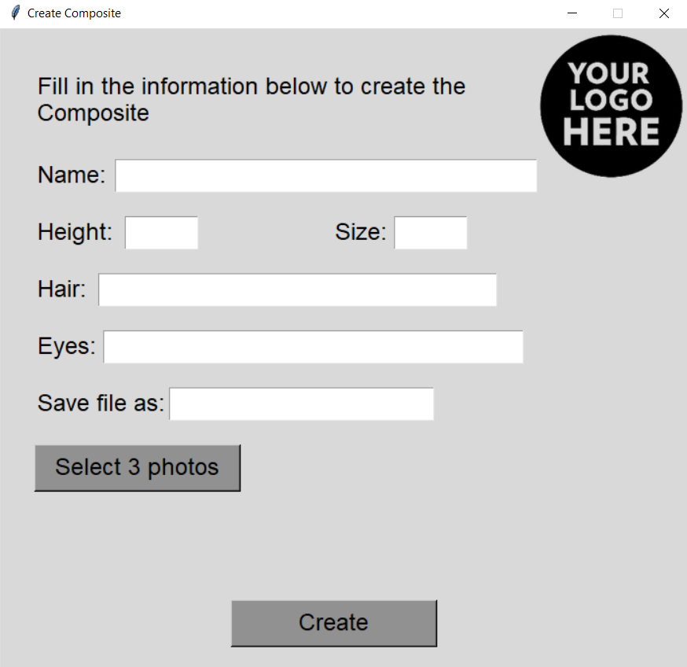
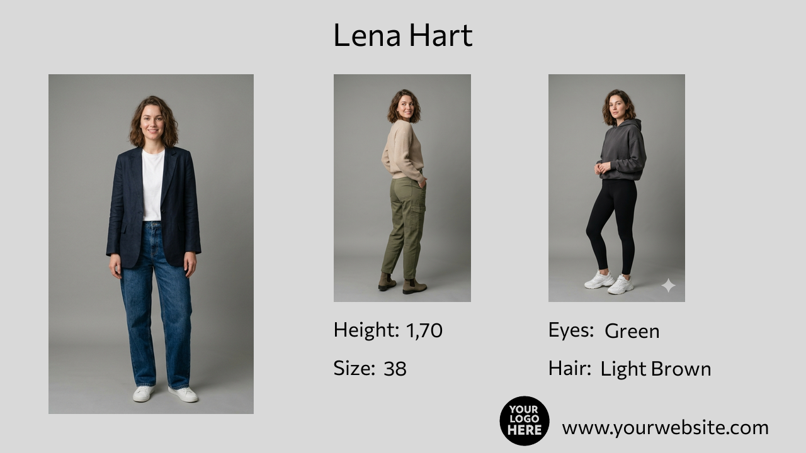
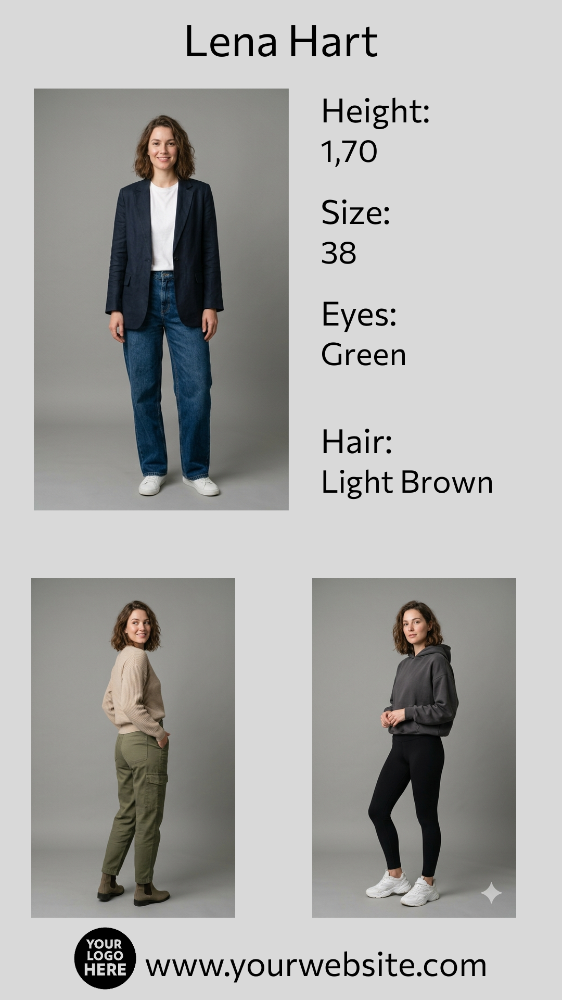

# Composite Maker


A Python GUI tool to generate model composites using Tkinter and Pillow.

Composite Maker allows users to create professional model composites (vertical and horizontal formats) using customizable templates, images, and text fields.  
It is designed to be simple, intuitive, and fully editable, making it ideal for agencies, photographers, and creators.

---

## 📸 Screenshots

### 🖥️ Interface


### 📐 Horizontal Composite Example


### 📏 Vertical Composite Example


---

## ✨ Features

- Generate **vertical** and **horizontal** model composites  
- Simple and intuitive **Tkinter GUI**  
- Uses **Pillow** for image processing  
- Customizable templates  
- Automatic text placement  
- Supports PNG templates and custom fonts  
- Includes placeholder logo and Commissioner font family  

---

## 📁 Project Structure

```
CompositeMaker/
│
├── create_composites.py
├── create_composites_instagram.py
│
├── Assets/
│   ├── template.png
│   ├── template_vertical.png
│   ├── your_logo_here.png
│   └── Commissioner (font files)
│
├── Screenshots/
│   ├── Interface.png
│   ├── Lena_Hart_Vertical.png
│   └── Lena_Hart_Horizontal.png
│
├── requirements.txt
└── README.md
```

## 🛠 Installation

Clone the repository:

```
git clone https://github.com/Rodrigovonhorn/CompositeMaker.git
cd CompositeMaker
```

Install dependencies:

```
pip install -r requirements.txt
```

> Tkinter is included by default in most Python installations on Windows.

---

## ▶️ How to Use

Run the main script:

```
python create_composites.py
```

Or the Instagram version:

```
python create_composites_instagram.py
```

Then:

1. Choose the script version
2. Fill in the text fields (name, height, size, eyes and hair)  
3. Select your model photos  
4. Generate the composite  
5. View the final image  

---

## 🎨 Customizing Templates

You can edit the PNG templates using any image editor:

- **Figma**  
- **Photoshop**  
- **GIMP**  
- **Photopea (free online)**  

To customize:

1. Open the template PNG  
2. Replace the placeholder logo  
3. Edit the website or text  
4. Export as PNG  
5. Replace the file inside the `Assets/` folder  

---

## 📦 Requirements

The project uses only one external dependency:

Pillow>=9.0


A `requirements.txt` file is included.

---

## 📜 License

This project is licensed under the **MIT License**.  
You are free to use, modify, and distribute it, as long as the original copyright notice is included.

---

## 🙌 Credits

Created by Rodrigo von Horn — São Paulo, Brazil.  
Open-source and free for anyone to use or improve.