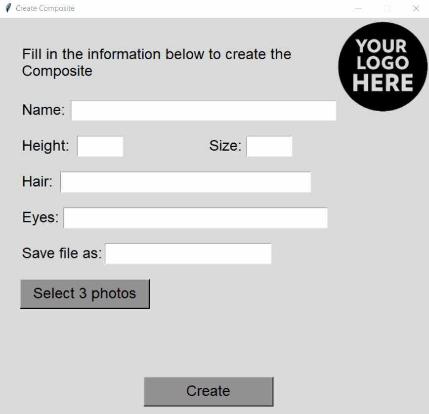

<!-- Banner -->
<p align="center">
  
</p>

<h1 align="center">📸 Composite Maker</h1>
<p align="center">
  A professional tool to generate model composites (vertical & horizontal) using Python, Tkinter and Pillow.
</p>

<p align="center">
  
  
  
  
</p>

---

## 🎥 Demo (GIF)

<p align="center">
  
</p>

---

## ✨ Why Composite Maker?

Model agencies, photographers and creators often need **clean, consistent and professional composites** for:

- Instagram portfolios  
- Facebook posts  
- Model submissions  
- Casting presentations  
- Digital comp cards  

Composite Maker solves this by providing:

- A **simple GUI**
- **Two professional layouts** (vertical & horizontal)
- **Editable templates**
- **Automatic text placement**
- **High‑quality export**

All in a lightweight, open‑source Python tool.

---

## 🖥️ Interface

<p align="center">
  
</p>

---

## 📐 Composite Examples

### Horizontal
<p align="center">
  
</p>

### Vertical
<p align="center">
  
</p>

---

## 🚀 Features

- ✔ Generate **vertical** and **horizontal** model composites  
- ✔ Clean and intuitive **Tkinter GUI**  
- ✔ Image processing powered by **Pillow**  
- ✔ Fully **customizable PNG templates**  
- ✔ Automatic text fields (name, height, size, eyes, hair)  
- ✔ Supports custom fonts (Commissioner included)  
- ✔ Includes placeholder logo  
- ✔ Ready for social media export  

---

## 📁 Project Structure

```
CompositeMaker/
│
├── create_composites.py                # Horizontal composite
├── create_composites_instagram.py      # Vertical composite
│
├── Assets/
│   ├── template.png
│   ├── template_vertical.png
│   ├── your_logo_here.png
│   └── Commissioner (font files)
│
├── Screenshots/
│   ├── Interface.png
│   ├── Lena_Hart_Vertical.png
│   ├── Lena_Hart_Horizontal.png
│   └── demo.gif   <-- Add your GIF here
│
├── requirements.txt
└── README.md
```

---

## 🛠 Installation

Clone the repository:

```bash
git clone https://github.com/Rodrigovonhorn/CompositeMaker.git
cd CompositeMaker
```

Install dependencies:

```bash
pip install -r requirements.txt
```

Tkinter is included by default on Windows.

---

## ▶️ How to Use

### Horizontal Composite
```bash
python create_composites.py
```

### Vertical Composite (Instagram)
```bash
python create_composites_instagram.py
```

### Steps

1. Fill in the text fields (name, height, size, eyes, hair)  
2. Select your model photos  
3. Generate the composite    

---

## 🎨 Customizing Templates

Templates can be edited using:

- Figma  
- Photoshop  
- GIMP  
- Photopea (free online)

Steps:

1. Open the PNG template  
2. Replace the placeholder logo  
3. Edit website, colors or layout  
4. Export as PNG  
5. Replace the file inside `Assets/`  

---

## 🗺️ Roadmap

- [ ] Add more layout presets  
- [ ] Add color filters  
- [ ] Add drag‑and‑drop support  
- [ ] Add batch processing  
- [ ] Add LinkedIn‑optimized composite  

---

## 🤝 Contributing

Pull requests are welcome.  
For major changes, please open an issue first.

---

## 📜 License

MIT License — free for personal and commercial use.

---

## 👤 Author

**Rodrigo von Horn** — São Paulo, Brazil  
Open‑source and free to improve.